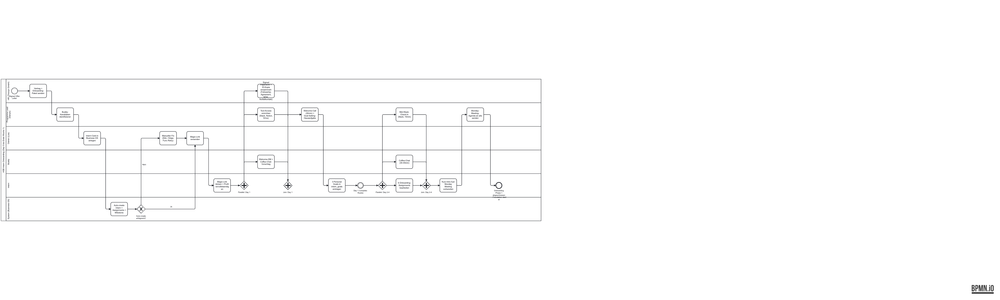

# Prozess: Intern Onboarding (Day-0 bis Ende Woche 1)

Vom Signed-Offer-Letter bis zum ersten Monday Meeting.

## Kontext

- **Wer nutzt:** Danylo (Programme Lead), Luis (Owner), Buddy (Peer), Intern selbst, Business OS
- **Warum:** Standardisierter Onboarding-Prozess über Thiocyn GmbH. Reduziert "verlorene Woche 1" und gibt Intern vom ersten Tag an klaren Roten Faden.
- **Rahmenbedingungen:** Fellowship ist **unentgeltlich, international, full remote, 12 Wochen**. Kein deutsches Arbeitgeber-Recht während der Fellowship.
- **Input:** Accepted Fellowship-Agreement + Start-Datum
- **Output:** Fellow ist Rookie 🌱, hat Buddy, hat 6 Onboarding-Assignments, nimmt am ersten Monday Meeting teil
- **SLA:** Day-1 komplett bis zur jeweiligen lokalen 17:00 Uhr (Fellow-Timezone)

## BPMN-Diagramm

- Source: [intern-onboarding.bpmn](./intern-onboarding.bpmn) (BPMN 2.0 XML, öffnen in [bpmn.io](https://demo.bpmn.io) oder Camunda Modeler zum Editieren)
- Preview: [intern-onboarding.png](./intern-onboarding.png)

## Swimlanes (Rollen)

| Swimlane | Verantwortung |
|---|---|
| **HR (Thiocyn)** | Fellowship-Agreement, Paperwork, NDA, DSGVO · **kein deutsches Payroll** bei unentgeltlichem internationalem Fellowship |
| **Programme Lead (Danylo)** | Buddy-Matching, Tool-Access, Welcome-Call, Monday-Meeting-Einladung |
| **Owner (Luis)** | Final Approval auf Intern-Card, Magic-Link-Versand, AI-Senior-Token-Budget |
| **Buddy** | Welcome-DM, Coffee-Chat (Tag 2–3), Fragen-Parkplatz |
| **Intern** | Unterlagen zurück, Account-Setup, 3 Personal Goals definieren |
| **System (Business OS)** | Auto-create `intern_accounts`, 6 Assignments, Rookie-Milestone, Email/Magic-Link |

## Haupt-Flow (Happy Path)

### Day 0 (Pre-Start)

1. **Start-Event:** Signed Offer Letter erhalten
2. **Task (HR):** Fellowship-Agreement + Onboarding-Paket an Intern senden (EN oder DE, je Fellow-Präferenz)
3. **Task (Programme Lead):** Buddy-Kandidaten identifizieren (3 Kriterien: Verfügbarkeit, Track-Fit, Persönlichkeit)
4. **Task (Owner):** Intern-Card in Business OS anlegen (Name, Email, Department, Brand, AI-Token-Budget)
5. **Gateway (System):** Auto-create läuft durch?
   - ✅ Ja → 6 Assignments + Rookie-Milestone erstellt
   - ❌ Nein → Fehler an Luis, manueller Fix, retry
6. **Task (Owner):** Magic-Link versenden (Resend noch manuell bis Domain verified)

### Day 1 (Start)

7. **Task (Intern):** Magic-Link klicken, Profil vervollständigen
8. **Parallel-Gateway** — drei Tracks gleichzeitig:
   - 8a. **Task (HR):** Signed Fellowship-Agreement + ID-Kopie + Notfallkontakt + Krankenvers.-Eigennachweis einsammeln (kein deutsches Payroll-Paperwork — Fellowship ist unentgeltlich + international)
   - 8b. **Task (Programme Lead):** Tool-Access (Slack, Notion, Drive-Ordner) einrichten
   - 8c. **Task (Buddy):** Welcome-DM mit 3 Fragen + Coffee-Chat-Vorschlag
9. **Join-Gateway:** Alle drei fertig?
10. **Task (Programme Lead):** Welcome-Call (30min): Programm-Überblick, erste Fragen, Goal-Setting-Hausaufgabe
11. **Task (Intern):** 3 Personal Goals in `intern_goals` eintragen
12. **End-Event Day 1:** Rookie 🌱 Milestone ist sichtbar im Fellow-Portal

### Day 2–4 (Buddy-Phase)

13. **Task (Buddy):** Coffee-Chat (30–45min, in-person oder Zoom)
14. **Task (Intern):** 6 Onboarding-Assignments bearbeiten (Profil, Tools, Brand-Walkthroughs lesen, Goals finalisieren, Buddy-Kennenlernen, Monday-Meeting-Prep)
15. **Task (Programme Lead):** Mid-Week-Check-In (15min-Slack-Message): "Blocker? Tools laufen?"

### Day 5 (Freitag vor erstem Monday-Meeting)

16. **Task (Intern):** Kurz-Intro (Name, Brand, Track-Interesse, ein lustiger Fakt) vorbereiten für Monday
17. **Task (Programme Lead):** Agenda Monday Meeting #1 an alle raus
18. **End-Event:** Onboarding-Phase-1 abgeschlossen, Übergang zu Foundation (Phase 2)

## Gateways / Exceptions

| Gateway | Exception | Fallback |
|---|---|---|
| Auto-create in Business OS | Edge-Function-Fehler | Luis manueller Fix via Supabase SQL |
| Magic-Link Delivery | Resend-Domain nicht verified | Manueller Link-Versand via jll@hartlimesgmbh.de |
| Tools-Access | SSO-Einladung bounced | Manuelles Add durch Valentin (BM-Admin) |
| Buddy krank / Urlaub | Kein Coffee-Chat Day 2–3 | Danylo übernimmt als Ersatz-Buddy für Woche 1 |
| Intern meldet sich nicht | Magic-Link nicht geklickt Day 1 | Danylo Anruf, 24h-SLA, sonst Eskalation Luis |
| Goal-Setting nicht gemacht | Keine Einträge in `intern_goals` bis Day 5 | Buddy pingt, Template-Goals als Fallback |

## Backed by in Business OS

| Step | DB-Tabelle / Component / Edge-Func |
|---|---|
| Intern-Card anlegen | `intern_accounts` (via `AcademyView` → `+ Add Intern`) |
| Auto-create | Edge-Function `create-intern-account` |
| 6 Assignments | `intern_assignments` ← `assignment_templates` |
| Rookie-Milestone | `intern_milestones` |
| Personal Goals | `intern_goals` |
| Monday-Meeting | `monday_meetings` + `intern_meeting_attendance` |
| Magic-Link | Supabase Auth `generateLink` API |
| Tool-Access | Slack-API, Notion-API (TBD), Drive (Valentin manuell) |

## Offene Gaps (vs. Soll-Prozess)

- [ ] Edge-Function `create-intern-account` hat 1 Fehler-Case (Resend-Bounce) ohne Fallback
- [ ] Tool-Access ist noch manuell (Slack + Drive) — Ziel: SCIM-Provisioning via Personio später
- [ ] Buddy-Matching hat keine UI — Danylo macht's manuell. Könnte ein Kanban-Board in Business OS sein.
- [ ] Goal-Setting-Templates fehlen — Intern startet "von weißem Blatt". Template-Library wäre high-leverage.
- [ ] Mid-Week-Check-In ist nicht automatisiert — Slack-Reminder für Danylo

## Metrics (Operational + Outcome)

**Operational (pro Intern):**
- Time-to-first-login: Soll < 4h nach Magic-Link
- Onboarding-Assignments complete bis Day 5: Soll 6/6
- Buddy-Chat stattgefunden bis Day 3: Soll 100%

**Outcome (Cohort):**
- % der Interns die Monday-Meeting #1 attended
- Net-Promoter-Score nach Woche 1 (1-Frage-Poll)
- Time-to-Rookie → Explorer (Wochen) — Median-Wert pro Cohort

## Verknüpft mit

- [../intern-academy/thiocyn-employment-onboarding.md](../intern-academy/thiocyn-employment-onboarding.md)
- [../intern-academy/buddy-program.md](../intern-academy/buddy-program.md)
- [../intern-academy/monday-meeting-template.md](../intern-academy/monday-meeting-template.md)
- [../intern-academy/program-buildout-roadmap.md](../intern-academy/program-buildout-roadmap.md)
